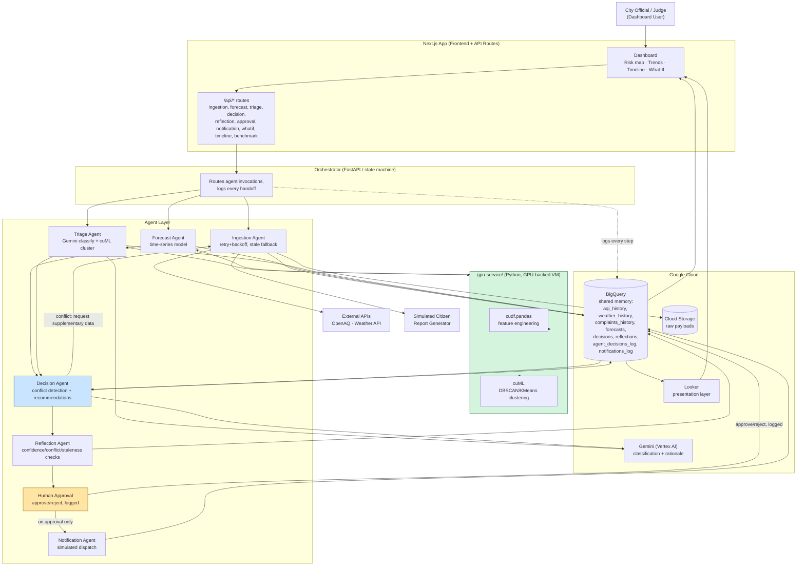

# CityPulse AI — Overall Architecture

**Source:** `04_ARCHITECTURE.md` §1 (textual diagram, reproduced below), §6 (deployment view), `05_TECH_STACK.md`, `ENDPOINT_OVERVIEW.md` (gpu-service addition). The Mermaid diagram below is a rendering of the same system your `04_ARCHITECTURE.md` already describes textually — no new architectural elements are introduced except the `gpu-service/` split, which is stated in `ENDPOINT_OVERVIEW.md`, and the Next.js/BigQuery/GCP labels, which come from `05_TECH_STACK.md`.

## Mermaid diagram



## ASCII fallback (identical structure, from `04_ARCHITECTURE.md` §1, unmodified)

```
                                  User (city official)
                                          │
                                          ▼
                                   Orchestrator
                                          │
                ┌─────────────────────────┼─────────────────────────┐
                ▼                         ▼                         ▼
        Ingestion Agent           Forecast Agent              Triage Agent
   (AQI, weather, retry/         (time-series AQI,        (citizen complaint
    recovery on failure)          confidence score)         clustering, cuDF/cuML)
                │                         │                         │
                └─────────────────────────┼─────────────────────────┘
                                          ▼
                                  Shared Memory
                              (BigQuery: today vs.
                               historical trend)
                                          ▼
                                  Decision Agent  ◄──────────┐
                              (risk score, conflict          │ supplementary
                               detection, recommendations)   │ data request
                                  │         ▲                │
                                  │         └────────────────┘
                                  ▼
                              Reflection Agent
                          (confidence check, gap
                           check, conflict check)
                                  │
                                  ▼
                              Human Approval
                          (approve / reject, logged)
                                  │
                                  ▼
                              Notification Agent
                       (simulated dispatch to schools,
                        hospitals, transit, citizens)
                                  │
                                  ▼
                              Looker Dashboard
                       (risk map, agent activity timeline,
                        what-if simulation control)
```

## Data flow summaries (all three, per `04_ARCHITECTURE.md` §3–§5)

**Happy path (§3):** Orchestrator triggers Ingestion → Forecast + Triage run in parallel, reading/writing BigQuery → both outputs feed Decision Agent → Reflection Agent reviews → human approves/rejects → on approval, Notification Agent dispatches (simulated) → Looker/dashboard updates with a new timeline entry.

**Conflict/escalation path (§4):** Triage detects a complaint spike, escalates directly to Decision Agent → Decision Agent compares against most recent Forecast, finds conflict (>1 risk tier divergence) → requests supplementary data from Ingestion Agent → Ingestion fetches and returns it → Decision Agent re-evaluates, produces a conflict-resolved recommendation with the resolution path visible in the rationale and timeline.

**Degraded/recovery path (§5):** Ingestion Agent's API call fails → retries with backoff → still fails after max attempts → falls back to last-known-good cached value, marks `status: "stale"`, notifies Decision Agent directly → Decision Agent applies a confidence penalty → Reflection Agent flags the staleness so it's visible to the human approver.

## Deployment view (per `04_ARCHITECTURE.md` §6)
- **Compute:** NVIDIA GPU-backed VM (or GKE node pool) hosts Forecast + Triage's `cudf.pandas`/`cuML` workloads; lighter agents (Ingestion, Decision, Reflection, Notification) run as standard containerized services
- **Orchestration:** containerized services coordinated by the lightweight orchestrator process; GKE is the "natural home" if you want to explicitly demonstrate Kubernetes Engine, though a single-VM deployment is stated as sufficient for the hackathon demo
- **Storage:** Cloud Storage (raw payloads) + BigQuery (structured historical/decision-log data)
- **Presentation:** Looker dashboard reading from BigQuery, embedding/linking the timeline and what-if control

## Why this satisfies "autonomous multi-agent system" (per `04_ARCHITECTURE.md` §7, reproduced directly)
- **Coordination:** orchestrator fans out to three parallel agents, merges output through shared memory into a single decision point
- **Task execution:** each agent executes a distinct task with its own model/tooling (forecasting model, clustering model, LLM summarization, rule-based risk synthesis)
- **Information retrieval:** Ingestion Agent retrieves live external data; Decision Agent retrieves supplementary data mid-reasoning when evidence conflicts
- **Decision support across a complex operational environment:** spans multiple stakeholder types (schools, hospitals, transit, citizens) with role-specific outputs from the same underlying risk assessment, human as final checkpoint
